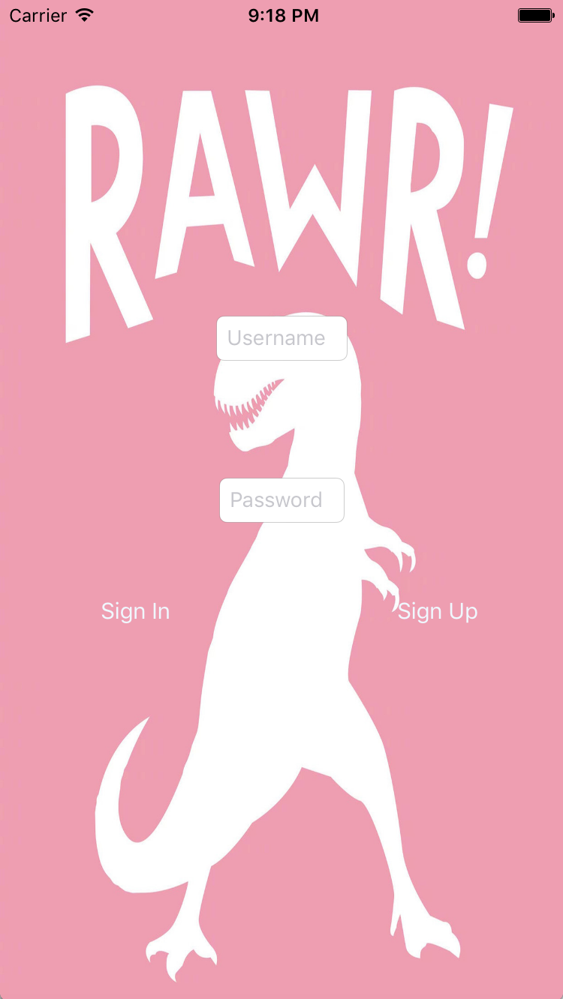
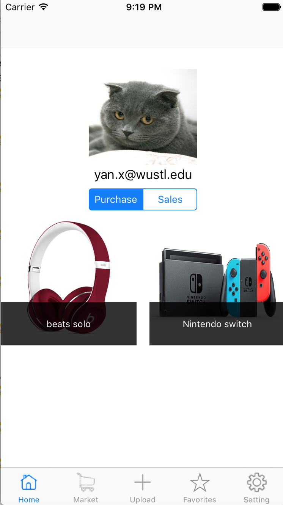
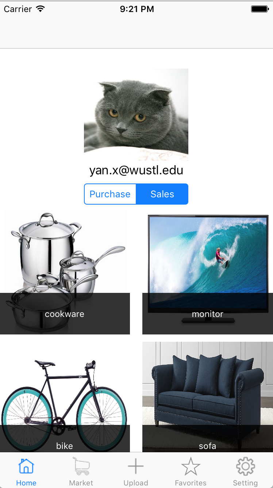
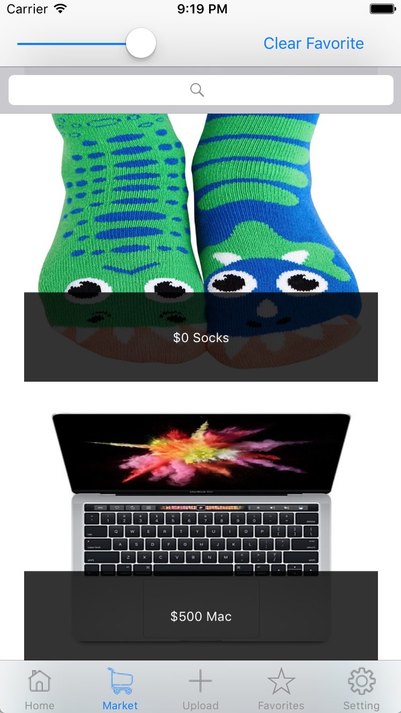
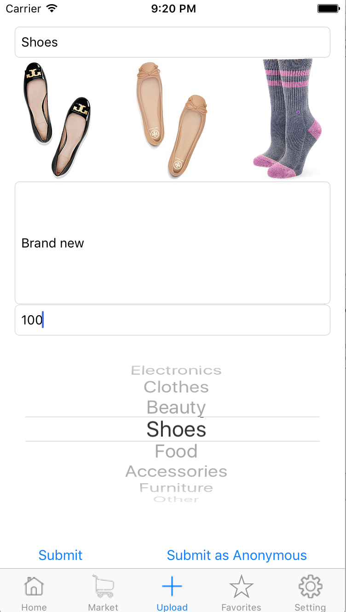
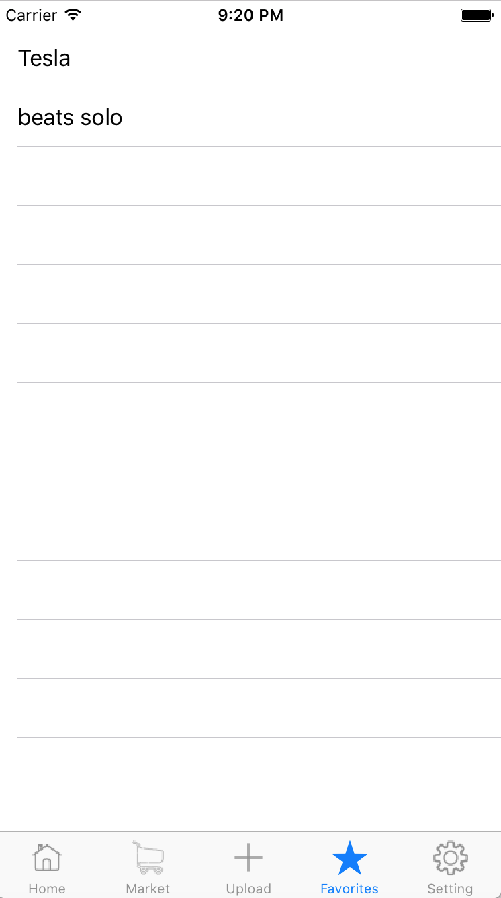
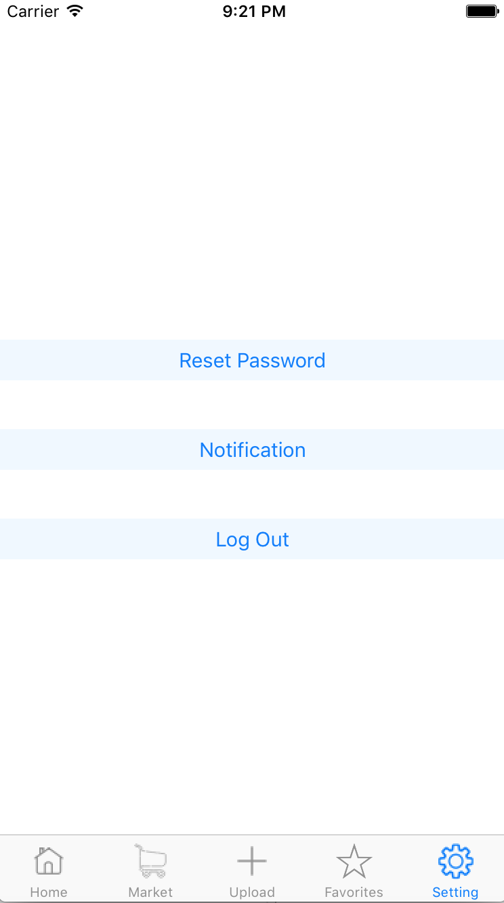

# WashU437
A mobile application of used item transaction platform for students at Washington University in St.Louis. 
Use swift for front-end and Firebase for back-end database.

Users must use wustl email to create an account. 
Personal profile for users to set profile pictures and manage their selling and buying products. 

A market page for users to browse and view the products they like. 
An upload page for sellers to upload their products. 

Bookmark page for favoourite products and a setting page for password reset and other functionalities. 

